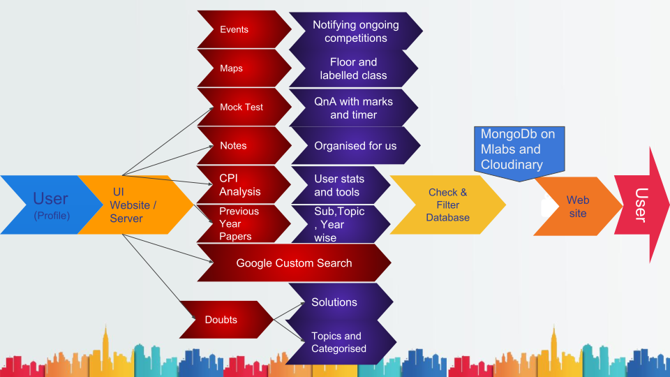

# College Genius - Vigyaan18 Winner
#### Education Vending System - lot's of educational resources organised via open database 
### [  website](https://collegegenius.herokuapp.com/) 
use user_ID : hello@gmail.com , password: siddharth
#### All Education at One Place
  - All Doubts and solutions
  - All notes, previous years, schedule, topics, and events
  - CPI enhancement tool and college map of NITRR
  - Quiz to test yourself
  - everything sorted by topics, users, date, sem, branch, keywords with google custom search

### New Features!

  - added college map of NITRR
  - compare CPI with others in the class
  - Schedule updated 
  - Search anything with the help of Google Custom Search


You can also:
  - ask inquiries to heads
 - check the whole database at database panel 
 - add important academic events(notified via SMS)

### Problem: 
In this era of digitalization, our college is not utilizing Technology to its fullest. we are not having a common education platform for all our educational resources

  > We faced this problem of arranging notes, 
  > asking others for previous year papers
  > wasted our’s and their’s time while 
  > still being confused.
  > This will save the time of both students and faculty
  > Doubts and CPI tools will prove useful, 
  > everything will be available to everyone
  > helping each and every student 

Let's make a better learning platform
## Sections

  - **HomePage** - interactive UI to all all sections
  - **Doubts** - ask or answer to other's doubts 
  - **Notes** - Open collection of notes sorted by subjects and Topics
  - **Enquiry_Us** - have questions then ask here
  - **Maps** - Needy college campus maps with all floors and labelled classes
  - **CPI enhancement** - various CPI tools
    - compute expected marks
    - quick CPI calculator
    - calculate CPI from semesters
    - calculate SPI and compare with others 
- **Previous_Year's** - all question papers sorted for practice
- **Quiz** - attempt designed quizzes in time for practice
- **Schedule** - Reminder for assignments, exams, and submissions 
- **Events** - Get notified and stay aware of all events and competitions being organized
- **Topics** - see resources by topics
- **Google_Custom_Search** - search everything by just a keyword
    - eg. all previous, notes, quiz, doubts of Lorentz equation
- **Database** - a large collection of all the resources on the website


  
## Tech
* [KeystoneJS CMS](https://keystonejs.com/) - framework for developing database-driven websites
* [ReactJs](https://reactjs.org/) - building user interfaces in admin panel
* [MongoDB](https://www.mongodb.com/) via [Mlabs](https://mlab.com/) - document-oriented database 
* [Cloudinary](https://cloudinary.com/) - Cloud Storage of media
* [GoogleCustomSearch](https://cse.google.com/cse/all) - for search queries
* [MSG91](https://msg91.com/) - SMS notify API
* [node.js](https://nodejs.org/en/) - backend
* [Express.Js](https://expressjs.com/) - fast node.js network app framework for requests 
* LandingPage - static page with simple tools

## Installation

College Genius requires [Node.js](https://nodejs.org/)  to run.
Install the dependencies and devDependencies and start the server.

```sh
$ git clone https://github.com/siddharthshah3030/CollegeGenius.git
$ cd CollegeGenius
$ yarn install 
$ yarn start
```
or use NPM (not recommended)
```sh
$ git clone https://github.com/siddharthshah3030/CollegeGenius.git
$ cd CollegeGenius
$ npm install 
$ npm start
```


## Development

Setup required for Cloudinary and Mlab Databases<br>
you will have to create an account there and add the link for connection to Database<br>
Some issues with GoogleCustomSearch 

Want to contribute? Great!
just make an issue for suggestions and bugs
or simply make a PR
### Contributors
##### [Siddharth Shah](https://github.com/siddharthshah3030) - Deadline_Driven_Development
##### [Prachi agrawal](https://github.com/Prachiagrawal1) - 

### Todos
 - add even better CPI tools
 - make database access without authentication
 - better UI of the Quiz section
 - support PDF
> help us improve this project and make a better learning environment for everyone 

### License

MIT


